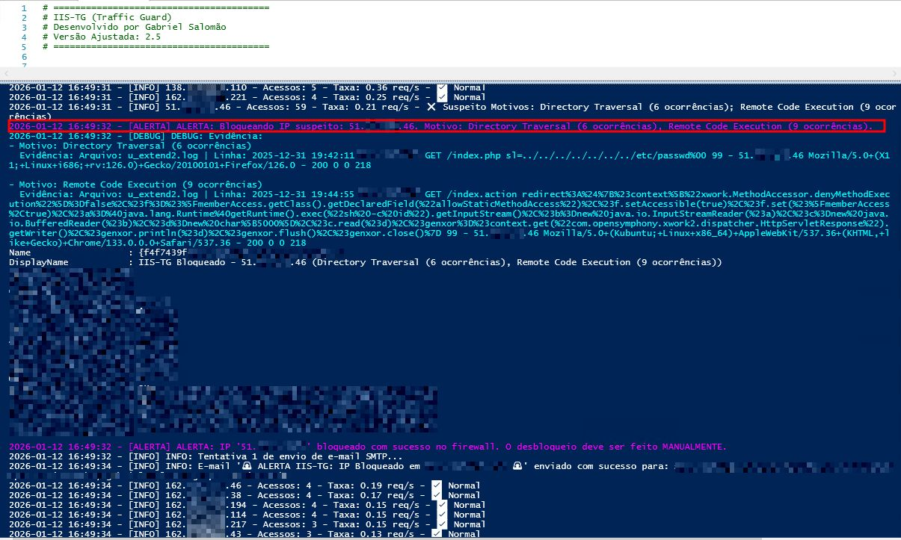
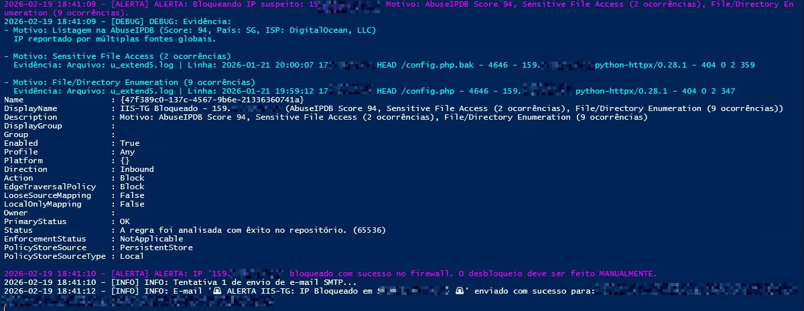
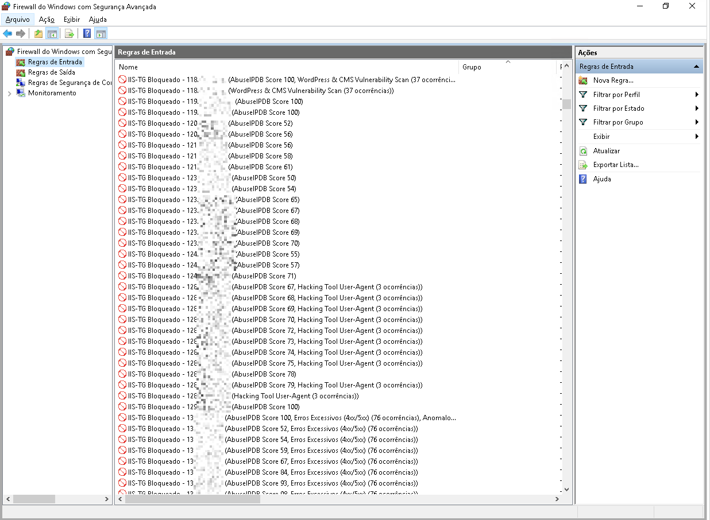

# 🔥🛡️ IIS-TG (Traffic Guard) - Host-Based Defense Architecture

> ⚠️ **Nota de Propriedade Intelectual (OpSec):**
> *O código-fonte completo (.ps1) do IIS-TG não é público. Ele foi desenvolvido como uma solução corporativa de defesa interna (Closed-Source / Corporate IP). Este repositório serve estritamente como uma **Documentação Arquitetural** para demonstrar a lógica de engenharia de detecção, a estruturação do projeto e os desafios superados.*

## 📌 Visão Geral
Em ambientes de alto volume transacional, a dependência exclusiva de análise manual de logs gera uma janela de exposição (MTTR) crítica. O **IIS-TG** é um motor de detecção de intrusão e resposta automatizada (HIPS/HIDS) desenvolvido nativamente em PowerShell. Ele atua diretamente na camada de host em servidores Microsoft IIS.

Seu foco é detectar e conter ataques volumétricos, explorações da camada de aplicação (OWASP Top 10) e tráfego malicioso em tempo real, aplicando bloqueios dinâmicos via Windows Defender Firewall.

---

## 🏗️ Arquitetura e Fluxo de Execução

O sistema foi desenhado para operar em servidores de missão crítica, priorizando resiliência e baixo impacto de I/O. O pipeline de detecção ocorre em quatro estágios:

### 1. Ingestão e Processamento Dinâmico (Stateful Log Reading)
Para evitar picos de CPU em arquivos de log que chegam a gigabytes:
* **Leitura Incremental:** Utiliza `System.IO.FileStream` e controle estrito de *offset* (`SeekOrigin`). O script processa apenas os bytes escritos desde a última verificação.
* **Mapeamento Dinâmico:** Lê a diretiva `#Fields` (padrão W3C) no cabeçalho dos logs para mapear dinamicamente as colunas críticas (`c-ip`, `cs-uri-stem`, `sc-status`), garantindo resiliência contra mudanças de formatação no IIS.

### 2. Motor de Detecção (Heurística + Assinaturas)
Cada requisição passa por um funil de inspeção dupla:
* **Análise Volumétrica:** Cálculo matemático da taxa de requisições por segundo (Req/s) para flagrar bots e DDoS na camada 7.
* **Inspeção de Payload (Regex):** Aplicação de expressões regulares otimizadas nos campos de URI, Query e User-Agent, detectando:
  * *SQL Injection (SQLi) e Cross-Site Scripting (XSS)*
  * *Directory Traversal e Remote Code Execution (RCE)*
  * *Hacking Tools (Nmap, Sqlmap, BurpSuite) e JNDI Injection (Log4Shell)*

### 3. Enriquecimento via Threat Intelligence (CTI)
IPs suspeitos são consultados na API da **AbuseIPDB**. Para garantir a estabilidade operacional, foram implementadas as seguintes mecânicas:
* **In-Memory Caching:** Hashes em memória evitam consultas redundantes para o mesmo IP.
* **Circuit Breaker & Key Rotation:** Para evitar *Rate Limits* (HTTP 429), o sistema rotaciona um array de chaves de API. Se todas esgotarem, um *Circuit Breaker* suspende temporariamente as requisições externas, garantindo que o motor de análise local continue rodando sem falhas.

### 4. Contenção Automatizada (Active Response)
Ao atingir o threshold de criticidade:
* Criação dinâmica de regras de bloqueio *inbound* no **Windows Defender Firewall**.
* Disparo de alertas via SMTP ao SOC/CSIRT contendo os Indicadores de Ataque (IoA), telemetria do IP e evidências extraídas do log bruto.

---

## 🚀 Desafios Técnicos Superados

* **Prevenção de Falsos Positivos:** Implementação de lógica de *Whitelisting* (Regex) para ignorar ranges de IPs internos (`10.x`, `172.x`) e rotinas de scanners de vulnerabilidade corporativos.
* **Desacoplamento de Configuração:** Toda a inteligência da ferramenta (Limites de taxa, regras Regex, credenciais seguras e thresholds da API) foi isolada em um arquivo `config.json`, permitindo que a equipe de operações (SOC) ajuste a detecção sem tocar no código-fonte.

---

## 📸 Evidências de Operação (Sanitizadas)

*(Screenshots mascarados para preservação de dados sensíveis da infraestrutura).*

### 1. Motor de Detecção em Tempo Real
> **Nota:** O log do console demonstra a detecção de anomalias (Score do AbuseIPDB e anomalia volumétrica) e a rotina de mapeamento dinâmico.

### 2. Alerta Analítico (SMTP)
> **Nota:** Alerta disparado automaticamente para a equipe de Resposta a Incidentes com as evidências de contenção.

### 3. Contenção Host-Based
> **Nota:** Regra criada dinamicamente no Windows Defender Firewall cortando a comunicação na origem.

---
*Desenvolvido e arquitetado por [Gabriel Salomão](https://www.linkedin.com/in/gsalomao).*
