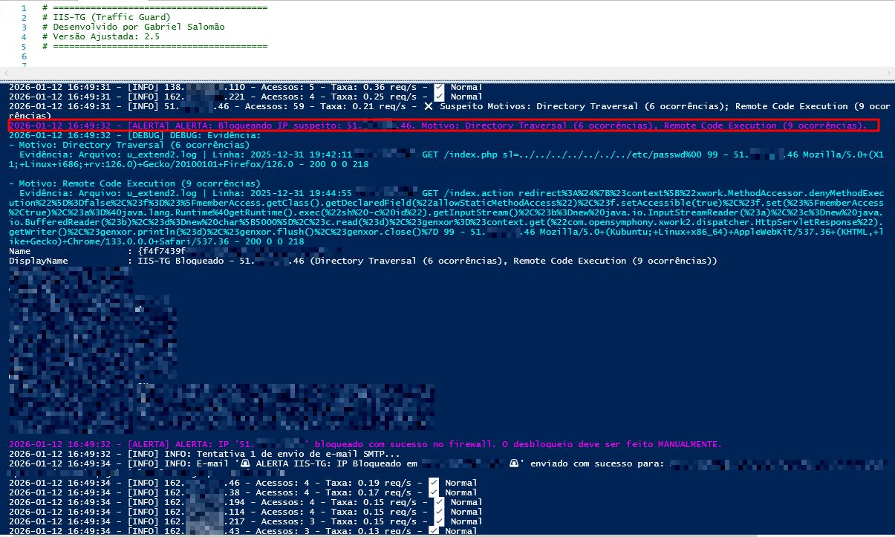
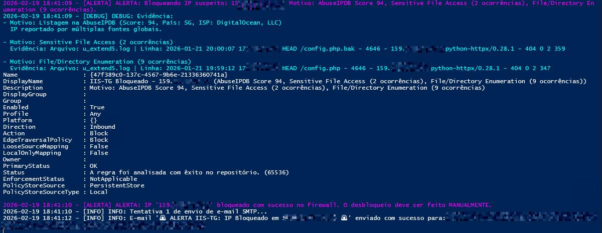
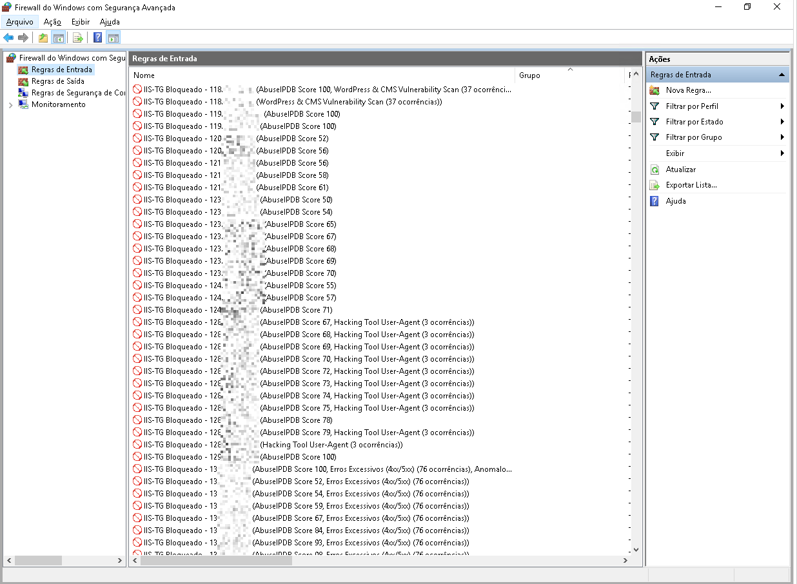

# 🔥🛡️ IIS-TG (Traffic Guard) - Host-Based Defense Architecture

> ⚠️ **Nota de Propriedade Intelectual (OpSec):**
> *O código-fonte completo (.ps1) do IIS-TG não é público. Ele foi desenvolvido como uma solução corporativa de defesa interna (Closed-Source / Corporate IP). Este repositório serve estritamente como uma **Documentação Arquitetural** para demonstrar a lógica de engenharia de detecção, a estruturação do projeto e os desafios superados.*

## 📌 Visão Geral
Em ambientes de alto volume transacional, a dependência exclusiva de análise manual de logs gera uma janela de exposição (MTTR) crítica. O IIS-TG é um motor de detecção de intrusão e resposta automatizada (HIPS/HIDS) desenvolvido nativamente em PowerShell. Ele atua diretamente na camada de host em servidores Microsoft IIS.

Seu foco é detectar e conter ataques volumétricos, explorações da camada de aplicação (OWASP Top 10), Prompt Injection (AI Abuse) e tráfego malicioso em tempo real, aplicando bloqueios dinâmicos via Windows Defender Firewall.

---

## 🏗️ Arquitetura e Fluxo de Execução

O sistema foi desenhado para operar em servidores de missão crítica, priorizando resiliência e baixo impacto de I/O. O pipeline de detecção ocorre em cinco estágios:

### 1. Ingestão e Processamento Dinâmico (Event-Driven Reading)
Para evitar picos de CPU em arquivos de log que chegam a gigabytes:
* **Monitoramento por Eventos:** Utiliza FileSystemWatcher para reagir instantaneamente a alterações nos logs, eliminando o custo computacional de varreduras constantes (polling).
* **Leitura Incremental:** Implementa System.IO.FileStream e controle estrito de offset (SeekOrigin). O script processa apenas os bytes escritos desde a última interação.
* **Mapeamento Dinâmico & Proxy Aware:** Lê a diretiva #Fields (padrão W3C) para mapear colunas críticas. Inclui suporte nativo para identificar o IP real via X-Forwarded-For, garantindo eficácia mesmo atrás de Load Balancers ou CDNs.

### 2. Motor de Detecção (Deep Inspection)
Cada requisição passa por um funil de inspeção de alta fidelidade:
* **Análise Volumétrica:** Cálculo matemático da taxa de requisições por segundo (Req/s) para flagrar bots, Fuzzing e DDoS na camada 7.
* **Deep URL Decode (Anti-Evasão):** IRotina recursiva de decodificação de payloads. Isso anula tentativas de evasão por Double Encoding, expondo a real intenção do atacante antes da análise das assinaturas.
* **Inspeção de Payload (Regex Otimizado)** plicação de expressões regulares nos campos de URI, Query e User-Agent para detecção de SQLi, XSS, Path Traversal e abuso de binários legítimos (LotL).

### 3. Enriquecimento e Inteligência (CTI & Honeytokens)
IPs suspeitos passam por uma camada extra de validação:
* **Honeytoken Defense:** Bloqueio imediato para IPs que acessam URIs de "isca" pré-definidas (ex: /.env, /config.php), assumindo intenção maliciosa instantânea sem necessidade de score prévio.
* **Threat Intelligence (AbuseIPDB):** Consultas em tempo real para reputação global.
* **Circuit Breaker & Key Rotation:** Sistema de rotação de chaves de API para evitar interrupções por limites de cota, garantindo que o motor local continue operando de forma autônoma.

### 4. Contenção Automatizada e SIEM Integration
Ao atingir o threshold de criticidade:
* **Active Response:** Criação dinâmica de regras de bloqueio inbound no Windows Defender Firewall (regras granulares por IP).
* **Saída Estruturada (JSON):** Geração nativa de logs para ingestão imediata por ferramentas como Wazuh, ElasticStack ou Splunk, facilitando a observabilidade centralizada.
* **Alertas Analíticos:** Disparo de e-mails via SMTP ao SOC contendo indicadores de ataque (IoA) e a evidência bruta extraída do log.

### 5. Lógica Adaptativa de Risco
Diferenciação entre alertas de Aviso Moderado e Bloqueio Crítico baseada na reputação global, permitindo uma postura de segurança agressiva contra redes conhecidas de botnets sem comprometer a disponibilidade de usuários legítimos.

---

## 🚀 Desafios Técnicos Superados

* **Memory Safety:** Implementação de rotinas de limpeza de cache em memória para evitar vazamento de RAM em cenários de milhões de eventos processados.

* **Desacoplamento de Inteligência:** Toda a lógica de detecção (Thresholds, Regras Regex e Honeytokens) é isolada em um arquivo config.json, permitindo ajustes rápidos sem alteração no motor principal.

* **Resiliência de I/O:** Leitura incremental otimizada capaz de processar volumes massivos de logs sem causar degradação de performance nas aplicações hospedadas no IIS.

---

## 📸 Evidências de Operação (Sanitizadas)

*(Screenshots mascarados para preservação de dados sensíveis da infraestrutura).*

### 1. Motor de Detecção em Tempo Real
> **Nota:** O log do console demonstra a detecção de anomalias (Score do AbuseIPDB e anomalia volumétrica) e a rotina de mapeamento dinâmico.

### 2. Alerta Analítico (SMTP)
> **Nota:** Alerta disparado automaticamente para a equipe de Resposta a Incidentes com as evidências de contenção.

### 3. Contenção Host-Based
> **Nota:** Regra criada dinamicamente no Windows Defender Firewall cortando a comunicação na origem.

---
*Desenvolvido e arquitetado por [Gabriel Salomão](https://www.linkedin.com/in/gsalomao).*
